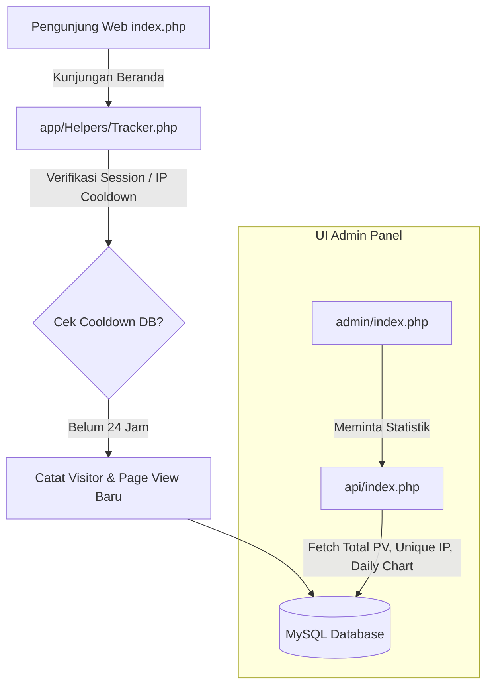

# Rencana Implementasi Statistika Pengunjung "My Profile" (cPanel + MySQL)

Rencana ini merinci penambahan fitur pelacakan dan statistik pengunjung pada portofolio publik (`index.php`) untuk kemudian disajikan secara visual di halaman dashboard admin lokal dengan aman tanpa merusak keandalan halaman beranda Anda.

---

## 📈 Konsep & Desain Arsitektur Statistika
Penghitungan pelacakan dilakukan server-side murni menggunakan PHP native untuk menghindari pemblokiran skrip oleh AdBlocker browser klien.



---

## 🗄️ Rancangan Struktur Tabel Database
Dua tabel baru akan ditambahkan untuk merekam statistik secara efisien:

### 1. Tabel **`visitor_logs`** (Detail Log Kunjungan Unik)
Merekam kedatangan pengunjung baru secara terpisah untuk data analisis geografi (opsional) atau teknologi.
- `id` `CHAR(36) PRIMARY KEY`
- `ip_address` `VARCHAR(45) NOT NULL` (Mendukung IPv4 & IPv6)
- `user_agent` `TEXT` (Untuk mendeteksi browser & perangkat OS)
- `visited_at` `TIMESTAMP DEFAULT CURRENT_TIMESTAMP`

### 2. Tabel **`daily_statistics`** (Agregasi Cepat Kunjungan Harian)
Membantu merender grafik chart performa secara kilat tanpa overload memproses jutaan raw log baris.
- `date` `DATE PRIMARY KEY`
- `page_views` `INT DEFAULT 0` (Jumlah klik total halaman luar)
- `unique_visitors` `INT DEFAULT 0` (Jumlah pengunjung unik harian)

---

## 🛠️ Garis Besar Urutan Pengerjaan (Plan Dikerjakan Nanti)

### Langkah 1: Registrasi Skema SQL Baru
- Buat query pembuatan dua tabel baru di `sql/schema.sql`.
- Jalankan patch basis data untuk mendirikan tabel `visitor_logs` dan `daily_statistics`.

### Langkah 2: Pembuatan Helper Evaluator `app/Helpers/Tracker.php`
- Membuat fungsi pelacak IP: `$_SERVER['REMOTE_ADDR']`.
- Memblokir penyimpanan untuk bot bot umum pencari celah (Crawler detector).
- Menyediakan cooldown berbasis waktu session (`session_start()`) agar penyegaran halaman *F5 / refresh* berturut-turut pada peramban yang sama tidak dihitung membeludak sebagai kunjungan pengunjung unik baru.

### Langkah 3: Injeksi Pelacak ke `index.php` Publik
- Panggil utility pelacak di baris teratas file publik:
  ```php
  <?php
  require_once __DIR__ . '/vendor/autoload.php';
  require_once __DIR__ . '/app/bootstrap.php';
  \App\Helpers\Tracker::track();
  ?>
  ```

### Langkah 4: Desain API Agregator (`api/index.php`)
- Menambahkan rute internal `/api/dashboard/browsers` dan `/api/dashboard/traffic` untuk mengagregasikan statistik:
  - Jumlah total *Page Views* sepanjang sejarah.
  - Jumlah *Unique IP Address* (Pengunjung Unik).
  - Data historis jumlah kunjungan harian selama 7 hari terakhir (untuk bagan grafik).

### Langkah 5: Presentasi Visual Indah di Dashboard (`admin/index.php`)
- Menambahkan kartu statistik baru berdampingan dengan Kategori/Tag/Projek.
- Membawa bagan grafik interaktif menggunakan pustaka visualisasi ringan **Chart.js** (dikunci dalam rancangan warna cyan-teal siber yang bercahaya).
